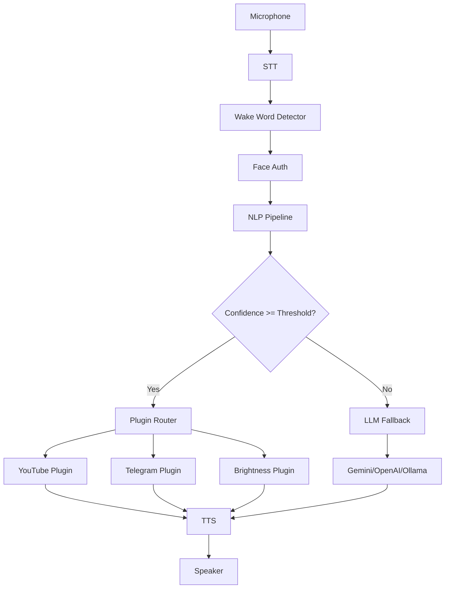
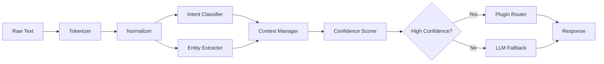
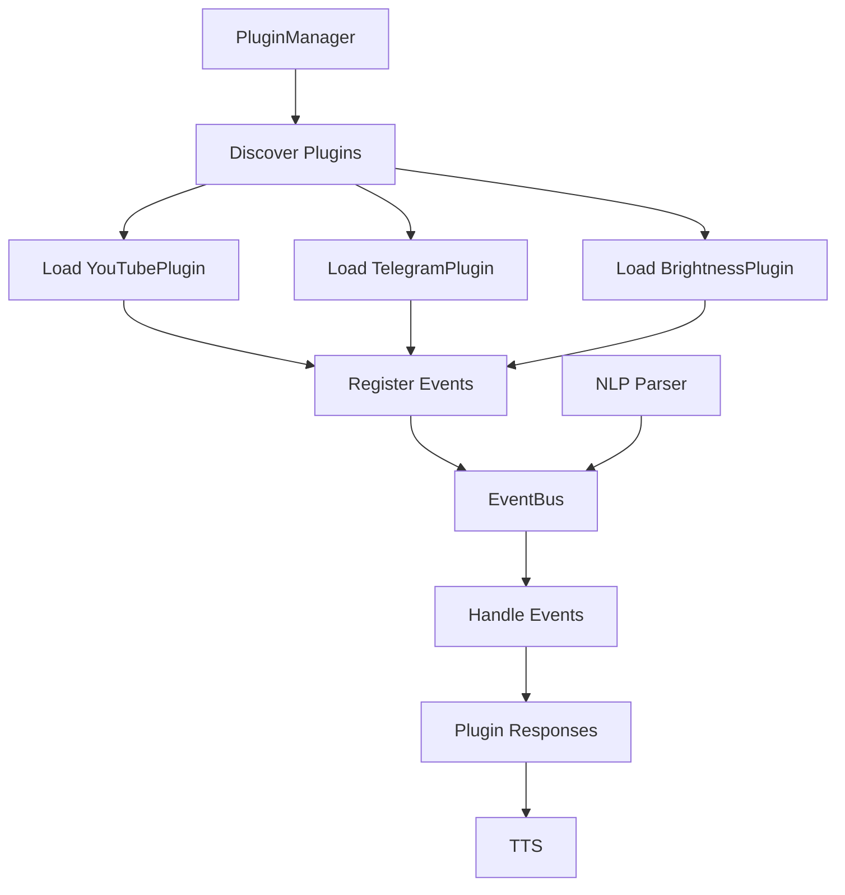

# Diego Desktop Assistant — Architecture

## Overview

Diego is a modular, production-grade AI desktop assistant. It uses a pipeline architecture:

```
Speech → STT → Preprocessor → Intent Classifier → Entity Extractor
→ Context Manager → Plugin Router → Response → TTS
```

LLMs (Gemini/OpenAI/Ollama/etc.) are **optional** providers used only for:
- Unknown intent handling
- Reasoning
- Coding
- Summarization
- Long conversations

Everything else executes **locally**.

## Directory Structure

```
Diego_desktop_agent/
├── main.py                 # Entry point
├── config/
│   ├── __init__.py
│   ├── settings.py         # Pydantic Settings (all credentials)
│   └── .env.example
├── core/
│   ├── __init__.py
│   ├── event_bus.py        # Async EventBus
│   ├── plugin_base.py      # BasePlugin ABC
│   └── plugin_manager.py   # Plugin discovery & lifecycle
├── nlp/
│   ├── __init__.py
│   ├── tokenizer.py        # spaCy / fallback tokenizer
│   ├── normalizer.py       # Text normalization + synonyms
│   ├── embeddings.py       # sentence-transformers embeddings
│   ├── classifier.py       # Intent classifier (semantic + fuzzy)
│   ├── entities.py         # Entity extraction (NER + regex)
│   ├── context.py          # Conversation context manager
│   ├── confidence.py       # Confidence scoring
│   ├── parser.py           # Main NLP pipeline orchestrator
│   ├── trainer.py          # Intent training data generator
│   └── evaluator.py        # Benchmarking & evaluation
├── voice/
│   ├── __init__.py
│   ├── stt.py              # Speech-to-Text (Google/Whisper)
│   └── tts.py              # Text-to-Speech (Coqui TTS)
├── ai/
│   ├── __init__.py
│   └── llm_client.py       # Unified LLM client (multi-provider)
├── plugins/
│   ├── __init__.py
│   ├── youtube_plugin.py   # YouTube control plugin
│   ├── telegram_plugin.py  # Telegram messaging plugin
│   └── brightness_plugin.py# Screen brightness plugin
├── memory/
│   ├── __init__.py
│   └── duckdb_store.py     # DuckDB persistent storage
├── telemetry/
│   ├── __init__.py
│   └── logger.py           # Structured JSON logging
├── desktop/                # (future) Desktop automation
├── vision/                 # (future) Computer vision
├── tests/
│   ├── __init__.py
│   ├── test_event_bus.py
│   └── test_nlp.py
├── auth/                   # Face authentication (legacy)
├── scripts/                # Legacy scripts (wrapped by plugins)
├── data/                   # DuckDB database files
├── .env.example
├── requirements.txt
└── README.md
```

## Data Flow

### 1. Wake Word Detection
- Microphone listens continuously
- Google Speech Recognition detects wake phrase
- Fuzzy matching handles mispronunciations

### 2. Face Authentication
- OpenCV captures frame
- face_recognition compares against known encodings
- Unknown faces trigger enrollment flow

### 3. Command Processing
```
User Speech
  → STT (Google Web Speech API)
  → Normalizer (lowercase, contractions, synonyms)
  → Intent Classifier (semantic similarity + fuzzy match)
  → Entity Extractor (spaCy NER + regex)
  → Context Manager (maintains conversation state)
  → Confidence Scorer (determines if LLM needed)
  → Plugin Router (dispatches to appropriate plugin)
  → Response Generation
  → TTS (Coqui TTS → paplay)
```

### 4. Plugin System
- Plugins inherit from `BasePlugin`
- PluginManager discovers plugins in `plugins/` directory
- Plugins register event handlers on the EventBus
- Events are dispatched asynchronously

### 5. Event Bus
- Decouples all components
- Supports wildcard handlers (`*`)
- Concurrent handler execution
- Error isolation (one handler failure doesn't block others)

## NLP Pipeline

### Intent Classification (3-tier)
1. **Semantic Similarity** (primary): sentence-transformers embeddings + cosine similarity
2. **Centroid Matching**: Per-intent embedding centroids
3. **Fuzzy Matching** (fallback): RapidFuzz ratio

### Entity Extraction
- spaCy NER for person names, locations
- Regex patterns for numbers, percentages, brightness, volume, speed, time
- Target name extraction for Telegram commands

### Context Management
- Maintains last N conversation turns
- Tracks active plugin session (e.g., YouTube mode)
- Slot-filling for multi-turn commands
- User preferences (in-memory + DuckDB)

### Confidence Scoring
- Threshold-based (configurable via `SIMILARITY_THRESHOLD`)
- Per-intent threshold adjustment (exit/shutdown need higher confidence)
- LLM fallback when confidence is low

## Storage (DuckDB)

Tables:
- `intents` — Intent definitions
- `intent_examples` — Training phrases with embeddings
- `entities` — Extracted entities
- `synonyms` — Synonym mappings
- `context_memory` — TTL-based context storage
- `command_history` — All user commands
- `user_preferences` — User settings
- `plugin_registry` — Installed plugins

## LLM Integration

Providers (in priority order):
1. Google Gemini
2. OpenAI
3. Ollama (local)

LLM is used **only** when:
- Intent confidence is below threshold
- Intent is "unknown"
- User asks for reasoning/coding/summarization
- Long conversation context

## Mermaid Diagrams

### Architecture Overview


### NLP Pipeline


### Plugin System


## Configuration

All configuration is centralized in `config/settings.py` using Pydantic Settings.
Credentials are read from `.env` file. **Never hardcode secrets.**

See `.env.example` for all available configuration options.

## Testing

```bash
# Run event bus tests
python -m pytest tests/test_event_bus.py -v

# Run NLP tests (requires model download)
python -m pytest tests/test_nlp.py -v

# Run all tests
python -m pytest tests/ -v
```

## Benchmarks

Run the evaluator to benchmark NLP performance:
```python
from nlp.evaluator import evaluator
from nlp.trainer import trainer

# Train with 100 examples per intent
await trainer.train(examples_per_intent=100)

# Evaluate
test_cases = {
    "greeting": ["hello", "hi Diego", "good morning"],
    "exit": ["goodbye", "bye", "see you later"],
    # ... add more test cases
}
results = evaluator.evaluate_classification(test_cases)
print(evaluator.report())